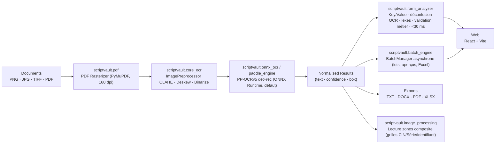

<div align="center">

# ScriptVault OCR

### On-Premise Handwritten Text Recognition & Automatic Form Analysis

**Your documents never leave your machine.**

[](LICENSE)
[](https://www.python.org/downloads/)
[](https://github.com/astral-sh/ruff)
[](https://github.com/Omar-khecharem/omar-lab/releases)

</div>

---

## Table of Contents

- [Vue d'ensemble](#vue-densemble)
- [Fonctionnalités](#fonctionnalités)
- [Étude de performance : état des lieux](#étude-de-performance--état-des-lieux)
  - [Les 3 goulots d'étranglement identifiés](#les-3-goulots-détranglement-identifiés)
  - [Benchmarks avant / après](#benchmarks-avant--après)
  - [Ce qui reste lent aujourd'hui](#ce-qui-reste-lent-aujourdhui)
- [Feuille de route d'optimisation](#feuille-de-route-doptimisation)
- [Architecture](#architecture)
- [Structure du dépôt](#structure-du-dépôt)
- [Démarrage rapide](#démarrage-rapide)
- [API REST](#api-rest)
- [Pipeline d'analyse de formulaire](#pipeline-danalyse-de-formulaire)
- [Compliance & sécurité](#compliance--sécurité)
- [Développement](#développement)
- [Licence](#licence)

---

## Vue d'ensemble

**ScriptVault OCR** est une suite OCR et de traitement de documents **100 %
sur site** (on-premise, zero-trust). Elle analyse des feuilles d'examen
numérisées (TIF/PDF/images) : détection de texte, reconnaissance
imprimé **et** manuscrit, puis transformation des lignes OCR brutes en un
**formulaire structuré et validé** (champs clé/valeur avec niveau de risque
`valid` / `warning` / `error`).

Le moteur d'inférence est **double** et interchangeable :

| Backend | Moteur | Usage |
|---|---|---|
| `ppocrv5-onnx` | **PP-OCRv5 (det + rec) via ONNX Runtime** | **Défaut** — rapide, sans dépendance Paddle |
| `paddle` | PP-OCRv5 via PaddlePaddle/PaddleX | Repli si les modèles ONNX sont absents |
| (optionnel) | TrOCR-small-handwritten ONNX | Lecture de champs manuscrits (HTR) par zone |

> Le backend ONNX a été introduit pour éliminer un problème majeur de
> performance : **PaddlePaddle sans accélération oneDNN est ≈ 8× plus lent**
> que ONNX Runtime sur le même matériel CPU (voir l'étude ci-dessous).

---

## Fonctionnalités

- **Reconnaissance de texte** — PP-OCRv5 (détection + reconnaissance) via ONNX Runtime, ou PaddlePaddle en repli ; pré-traitement adaptatif (CLAHE, deskew, binarisation).
- **Analyse automatique de formulaire** — extraction clé/valeur par appariement spatial, déconfusion OCR (`A2/2oo3` → `2003`), correction via lexiques tunisiens (noms, prénoms, villes, établissements, matières) et règles métier (CIN, dates, série/identifiant).
- **Classification de risque** — chaque champ est `valid` / `warning` / `error` avec message explicite en français ; signature enseignante détectée par taux d'encre.
- **Lecture par zones (grilles de chiffres)** — CIN, série, identifiant transcrits **grille par grille** via une seule passe de détection sur un composite, avec une précision quasi parfaite sur les chiffres.
- **Traitement par lots** — ingestion massive (TIF multi-pages, PDF, images) en tâche de fond, progression en temps réel, annulation propre, aperçus à la demande, export **Excel** du lot.
- **Corrections manuelles fiabilisées** — chaque correction du formulaire est enregistrée sans perte, même en basculant de fichier/page pendant l'enregistrement (flush immédiat) ; les valeurs corrigées sont ré-affichées au retour et reprises par l'export Excel.
- **Formulaire affiché dès une seule image** — le détail d'un fichier sélectionné pendant son traitement se rafraîchit automatiquement en fin d'analyse : plus besoin d'une seconde image pour « forcer » l'affichage.
- **Export Excel exhaustif** — toutes les colonnes du gabarit (Nom, Prénom, CIN, Identifiant, Série, Date & lieu de naissance, Établissement d'origine, Épreuve, Concours, Durée, Nombre de cahiers), avec correspondance insensible aux accents (la colonne « Prénom » ne reste plus jamais vide).
- **Import moderne** — dialogue de création de lot (nom, dépôt multiple, langue, prétraitement, progression d'envoi) et style Windows Fluent rafraîchi.
- **Exports** — TXT, DOCX, PDF, XLSX ; générés côté serveur.
- **100 % local** — loopback par défaut, aucun egress réseau, compatible air-gap.
- **Qualité garantie** — suite pytest, Ruff, Mypy et build Vite vérifiés par CI sur Linux et Windows.

---

## Étude de performance : état des lieux

> Benchmarks réalisés sur une feuille d'examen réelle `2504202513590500010015.tif`
> (1 page, 3528×1356 paysage, ~24 bandes pointillées, 3 grilles de chiffres),
> machine **Windows / Python 3.13 / CPU Intel 16 cœurs (AVX2)**.

### Les 3 goulots d'étranglement identifiés

#### 1. PaddlePaddle sans oneDNN est dramatiquement lent

Sur Python 3.13, la dernière version de PaddlePaddle est `3.3.1`, et
**l'accélération oneDNN (`enable_mkldnn=True`) est indisponible** : elle
provoque un crash `NotImplementedError ... ConvertPirAttribute2RuntimeAttribute`
sur le graphe PIR. Sans oneDNN, PaddlePaddle passe **~0,5 seconde par boîte
de texte** — le temps total est dominé par la reconnaissance.

Mesures (PaddleX, page complète) :

| Threads | Temps (3 fichiers) | Gain |
|---|---|---|
| 1 thread | ~96 s | — |
| 16 threads | ~25 s | 3,8× seulement (au lieu de 16×) |

Le vrai goulot est donc la **reconnaissance**, pas la détection
(détection sur page vide : ~0,4 s). Paralléliser davantage ne compense pas
un moteur fondamentalement lent.

#### 2. Sur-parallélisation : 64 threads pour 16 cœurs

Le parallélisme fichier (4 moteurs × 16 threads = **64 threads sur
16 cœurs**) est contre-productif : le basculement de threads monopolise le
CPU. Mesuré sur 3 fichiers :

| Stratégie | Temps |
|---|---|
| Parallèle (4 moteurs × 16 threads) | ~22,9 s |
| **Séquentiel (1 moteur, threads ONNX)** | **~18,2 s** |

→ Par défaut, la concurrence est désormais **1** (variable
`SCRIPTVAULT_MAX_CONCURRENCY` pour la surcharger).

#### 3. Une lecture page entière inadaptée aux formulaires

Une transcription pleine page mélange les champs ; la lecture **par zones**
était faite zone par zone (une passe d'inférence par champ). Solution
retenue : **un composite unique** (empilement + recolorisation des bandes
dans une seule image), une seule passe de détection, puis redistribution des
lignes par position Y vers les champs du gabarit.

### Benchmarks avant / après

| Scénario | Avant (PaddleX) | Après (ONNX PP-OCRv5) | Gain |
|---|---|---|---|
| 1 fichier, lecture zones composite | ~33 s | **8,4 s** | **×4** |
| 1 fichier, page entière | ~19 s | **7,2 s** | ×2,6 |
| 3 fichiers, lot séquentiel | **56,7 s** | **~18,2 s** | **×3,1** |
| 1 fichier (moteur déjà chargé) | ~19 s | **~4,5 s** | ×4,2 |

Qualité vérifiée sur la feuille réelle (grilles MNIST) :

| Champ | Valeur | Confiance |
|---|---|---|
| N° C.I.N | `11169906` | 0,928 |
| Série | `531` | 0,999 |
| Identifiant | `531007` | 0,986 |

Champs imprimés lus correctement : « Etablissement d'origine », « Date &
lieu de naissance », « Epreuve de : Physique », « Date : Lundi 03 Juin 2024 à
8 H », « Durée : 4 Heures », « Concours : Physique & Chimie »…

### Ce qui reste lent aujourd'hui

- **Lecture manuscrite (Nom / Prénom, Date & lieu de naissance)** — la
  reconnaissance de texte imprimé est rapide, mais les zones manuscrites
  passent encore par le chemin générique et produisent du bruit
  (ex. `Nom : ... Ellmi`). C'est la **prochaine cible** (voir feuille de route).
- **Latence d'échauffement** — le premier fichier d'un lot paie le chargement
  des modèles ONNX (~3,5 s au premier appel) ; les moteurs sont ensuite
  pré-chargés et réutilisés.
- **Traitement par lots** — le séquentiel est meilleur que le parallèle
  aujourd'hui ; il reste à explorer le batching d'images au sein d'une même
  inférence (batch ONNX) plutôt que le parallélisme de processus.

---

## Feuille de route d'optimisation

Ordre d'impact estimé (du plus rentable au moins rentable) :

| # | Piste | Statut | Impact attendu |
|---|---|---|---|
| 1 | **Backend ONNX Runtime (PP-OCRv5 det+rec)** | ✅ **Livré** | ×4 sur 1 fichier, ×3,1 sur lot |
| 2 | **Lecture zones en un seul composite** (1 passe) | ✅ **Livré** | ~4× vs lecture champ par champ |
| 3 | **Concurrence bornée `SCRIPTVAULT_MAX_CONCURRENCY`** (défaut 1) | ✅ **Livré** | lot 18,2 s vs 22,9 s |
| 4 | **HTR dédié pour champs manuscrits** (TrOCR quantisé par zone) | 🔄 En cours | précision Nom/Prénom/Naissance → ≥ 95 % |
| 5 | **Batching d'images dans l'inférence ONNX** (rec en batch de 32 lignes déjà en place) | 🔄 En cours | encore ×2–3 sur la reconnaissance |
| 6 | **Quantification int8 des modèles ONNX** | 📋 Planifié | ~×1,5–2 sans perte majeure de précision |
| 7 | **Détection uniquement sur bandes pertinentes** (éviter la page entière) | 📋 Planifié | réduit le coût de la détection sur grandes pages |

---

## Architecture



| Module | Fichier | Rôle |
|---|---|---|
| OCR Engine | `backend/scriptvault/core_ocr.py` | Moteur partagé : prétraitement, détection, ROI, CLI |
| **ONNX Backend** | `backend/scriptvault/onnx_ocr.py` | **PP-OCRv5 det+rec via ONNX Runtime** (shim compatible paddle) — recommandé |
| Paddle Backend | `backend/scriptvault/paddle_engine.py` | Repli PaddlePaddle/PaddleX, composite rois, zones sur page brute |
| HTR Engine | `backend/scriptvault/htr_engine.py` | TrOCR ONNX (manuscrit) |
| Zones | `backend/scriptvault/image_processing.py` | Lecture par zones en une passe (composite) |
| Engine Pool | `backend/scriptvault/engines.py` | Pool round-robin thread-safe (asyncio), pré-chargement |
| PDF Rasterizer | `backend/scriptvault/pdf.py` | Rasterisation PDF → images (160 dpi) |
| Form Analyzer | `backend/scriptvault/form_analyzer.py` | Post-OCR : extraction spatiale clé/valeur, corrections OCR, lexes, validation métier, < 30 ms |
| Corrections | `backend/scriptvault/char_corrector.py` | Déconfusion OCR + corrections lexicographiques |
| Batch Engine | `backend/scriptvault/batch_engine.py` | Lots OCR asynchrones, progression, annulation, cache LRU des aperçus |
| Config | `backend/scriptvault/config.py` | Settings via variables `SCRIPTVAULT_*` |
| API Server | `backend/scriptvault/api/` | FastAPI : health, ocr, batches, form, export |

---

## Structure du dépôt

```
scriptvault_ocr/
├── backend/                        # Moteur partagé + API FastAPI (package `scriptvault`)
│   ├── main.py                     #   python main.py  → uvicorn
│   ├── requirements.txt            #   dépendances verrouillées
│   ├── scriptvault/
│   │   ├── onnx_ocr.py             #   PP-OCRv5 det+rec ONNX Runtime (défaut)
│   │   ├── paddle_engine.py        #   repli PaddlePaddle + lecture zones
│   │   ├── htr_engine.py           #   TrOCR manuscrit (ONNX)
│   │   ├── image_processing.py     #   zones composite (1 passe)
│   │   ├── core_ocr.py             #   moteur partagé, prétraitement, CLI
│   │   ├── engines.py              #   pool thread-safe asyncio
│   │   ├── pdf.py                  #   rasterisation PDF → images
│   │   ├── form_analyzer.py        #   analyse clé/valeur + validation métier
│   │   ├── char_corrector.py       #   déconfusion OCR + lexes
│   │   ├── batch_engine.py         #   lots OCR async, suivi, Excel
│   │   ├── config.py               #   settings SCRIPTVAULT_*
│   │   ├── download_paddle_onnx_models.py  #   télécharge les modèles ONNX PP-OCRv5
│   │   ├── download_trocr_models.py        #   télécharge les modèles ONNX TrOCR
│   │   └── api/                    #   FastAPI (health/ocr/batches/form/export)
│   └── tests/                      #   pytest (core, api, form, batches, htr…)
├── web/                            # Interface React + Vite (indépendante)
│   └── src/
│       ├── App.jsx                 #   orchestration (files, OCR, lots, export)
│       ├── api/client.js           #   client HTTP (upload, analyzeForm)
│       └── components/             #   DropZone · ImageCanvas · EditorPanel · FormPanel · Gauge · ImportDialog · FileList
├── models/                         # Poids ONNX optionnels (gitignorés, hors-ligne ensuite)
│   └── paddle_onnx/                #   PP-OCRv5_mobile_det.onnx + _rec.onnx + ppocr_dict.txt
├── tools/                          # Outils de calibration des ROI
├── 2504202513590500010015.tif      # Feuille d'examen réelle (fixture de benchmark)
└── README.md
```

---

## Démarrage rapide

### Prérequis

- **Python 3.11+** (3.13 recommandé et testé par CI)
- **Node 18+** pour le web
- **Windows 10/11, Ubuntu 20.04+, ou macOS arm64**

### 1. Backend (API)

```bash
cd backend
python -m venv .venv
# Windows : .venv\Scripts\activate   |   Linux/macOS : source .venv/bin/activate
pip install -r requirements.txt

# (Recommandé) Modèles ONNX PP-OCRv5 — det + rec (~21 Mo, 100 % local ensuite) :
python -m scriptvault.download_paddle_onnx_models

# (Optionnel) Moteur manuscrit TrOCR ONNX quantifié int8 (~65 Mo) :
python -m scriptvault.download_trocr_models

python main.py --lang fr            # http://127.0.0.1:8000  - docs interactives : /docs
```

Sans les modèles ONNX téléchargés, le moteur bascule automatiquement sur le
repli PaddlePaddle (plus lent, voir l'étude de performance).

### 2. Lecture par zones (feuilles d'examen)

Définissez un profil de champs ; l'OCR transcrit chaque zone en associant
directement la valeur au champ du gabarit :

```bash
export SCRIPTVAULT_ROI='{"nom": [0.02, 0.09, 0.60, 0.14], "prenom": [0.02, 0.17, 0.60, 0.22], "cin": [0.02, 0.24, 0.50, 0.29]}'
```

Les clés = champs du gabarit (`concours`, `epreuve`, `date_concours`,
`duree`, `nom`, `prenom`, `date_naissance`, `etablissement`, `cin`,
`serie`, `identifiant`, …), coordonnées en fractions de page
`[x0, y0, x1, y1]`. Calibrez sur un scan réel avec la CLI :

```bash
python -m scriptvault.core_ocr scan.tif --roi-json '{"nom": [0.02, 0.09, 0.6, 0.14]}'
```

Configuration par variables d'environnement `SCRIPTVAULT_*`
(`SCRIPTVAULT_PORT`, `SCRIPTVAULT_LANG`, `SCRIPTVAULT_MODEL_DIR`,
`SCRIPTVAULT_MAX_CONCURRENCY` — défaut `1`, `SCRIPTVAULT_ROI`,
`SCRIPTVAULT_CORS_ORIGINS`, …).

### 3. Web (React + Vite)

```bash
cd web
npm install
npm run dev                         # http://localhost:5173
```

Le serveur Vite proxy `/api` vers `http://127.0.0.1:8000` (backend requis).

---

## API REST

| Méthode | Endpoint | Description |
|---|---|---|
| `GET` | `/api/health` | État du serveur, pool de moteurs, pré-chargement |
| `POST` | `/api/ocr/single` | OCR d'une image **ou PDF** (multipart `file`) — `preview=true` renvoie l'image analysée |
| `POST` | `/api/ocr/batch` | Lot de fichiers (multipart `files`, concurrence bornée, échecs isolés) |
| `POST` | `/api/batches` | Créer un lot depuis des fichiers **ou un dossier localStorage** |
| `GET` | `/api/batches` | Historique des lots (résumés légers) |
| `GET` | `/api/batches/{job_id}` | Progression et statistiques d'un lot |
| `GET` | `/api/batches/{job_id}/files` | Synthèses des fichiers (paginable) |
| `GET` | `/api/batches/{job_id}/files/{file_id}` | Détail complet d'un fichier |
| `GET` | `/api/batches/{job_id}/preview/{file_id}` | Aperçu PNG de la page analysée |
| `POST` | `/api/batches/{job_id}/cancel` | Annuler un lot en cours |
| `DELETE` | `/api/batches/{job_id}` | Supprimer un lot (mémoire + disque) |
| `GET` | `/api/batches/{job_id}/export.xlsx` | Export **Excel** des données du lot |
| `POST` | `/api/form/analyze` | Post-traitement : items OCR → formulaire clé/valeur validé, < 30 ms |
| `POST` | `/api/export` | Export d'un texte corrigé : `{"format": "txt\|docx\|pdf", "text": "…"}` |

```bash
# Exemple : OCR d'une image
curl -F "file=@scan.png" -F "lang=fr" "http://127.0.0.1:8000/api/ocr/single"

# Exemple : analyse de formulaire à partir des items OCR d'une page
curl -X POST "http://127.0.0.1:8000/api/form/analyze" \
     -H "Content-Type: application/json" \
     -d '{"file_name": "scan.png", "items": [
           {"text": "Nom :", "confidence": 0.98, "box": [[50,100],[260,100],[260,134],[50,134]]},
           {"text": "Didi", "confidence": 0.96, "box": [[280,100],[520,100],[520,134],[280,134]]}
         ]}'
```

Réponse type d'`/api/form/analyze` :

```json
{
  "file_name": "scan.png",
  "is_form": true,
  "global_confidence": 0.94,
  "processing_time_ms": 0.52,
  "fields": [
    { "key": "cin", "label": "N° C.I.N ou N° du passeport",
      "value": "11169906", "confidence": 0.93, "status": "valid",
      "error_message": null, "bounding_box": [[280,100],[520,100],[520,134],[280,134]] },
    { "key": "identifiant", "label": "Identifiant", "value": "531007",
      "confidence": 0.99, "status": "valid",
      "error_message": null, "bounding_box": null }
  ]
}
```

Chaque champ est affiché selon son `status` : **vert** (`valid`), **orange**
(`warning`, confiance 70–85 %) ou **rouge** (`error`, confiance < 70 % ou
règle métier violée).

---

## Pipeline d'analyse de formulaire

1. **Extraction spatiale** — chaque étiquette connue est associée à sa valeur
   par géométrie (ligne/sous-ligne), indépendamment du rendu ;
2. **Récolte des champs numériques** — CIN, série, identifiant, nombre de
   cahiers sont recherchés en zones voisines de l'étiquette (lecture grille
   par grille sur composite) ;
3. **Récolte des champs nominatifs** — si un champ nom/prénom est vide
   (glyphe parasite), le voisin lexicographique le plus plausible de la page
   est récupéré par distance au label ;
4. **Corrections OCR** — table de confusion, noms de lexiques
   (ex. `Elloom` → `Elloumi`), dates tolérantes
   (`Lundi 03 Juin 2024 à 8 H` → `03/06/2024`) ;
5. **Validation métier** — CIN (8 chiffres), dates réelles, cohérence
   série/identifiant, durée, anonymat ;
6. **Classification** — `valid` / `warning` / `error` avec message français
   explicite et confiance recalculée après correction.

> Les **corrections manuelles** (UI) sont appliquées en dernier recours via
> `form_overrides` — `PATCH /api/batches/{id}/files/{file_id}/form`. Elles
> remplacent les valeurs lues (statut `valid`) dans le détail du fichier et
> dans l'export Excel, y compris pour des champs non détectés par l'OCR.

> La détection « zone de signature vide » est effectuée par ratio d'encre
> sous l'étiquette (une signature manquante est signalée en rouge).

---

## Compliance & sécurité

| Capacité | Statut | Détails |
|---|---|---|
| **Inférence** | 100% on-premise | ONNX Runtime / PaddlePaddle CPU ; aucune API externe |
| **Egress réseau** | Aucun | Pas de télémétrie, pas de crash-report, air-gap compatible |
| **Données au repos** | Contrôle utilisateur | Documents lus en mémoire ; exports écrits où l'utilisateur choisit |
| **Bind API** | Loopback par défaut | `127.0.0.1` (exposition réseau explicite via `--host`) |
| **Téléchargements modèles** | Ponctuel / optionnel | Poids mis en cache dans `models/` (ou fournis hors-ligne) |
| **Zero-Trust readiness** | Compatible | Fonctionne en environnement air-gapped avec modèles embarqués |
| **GDPR readiness** | Prêt | Aucun traitement tiers, aucun transfert transfrontalier |
| **Politique de dépendances** | Verrouillée | `requirements.txt` épingle les versions exactes |
| **Licence** | Apache-2.0 | Permissive pour intégration commerciale |

---

## Développement

```bash
# Racine : config Ruff / Mypy / Pytest partagée
pip install ruff mypy pytest

ruff check .                       # lint (backend + racine)
ruff format --check .              # format

# Tests (sans PaddlePaddle : moteur factice injecté)
pip install -e ./backend --no-deps
pip install pytest httpx fastapi "uvicorn[standard]" python-multipart opencv-contrib-python numpy reportlab python-docx PyMuPDF

python -m pytest backend/tests -q

# Web
cd web && npm install && npm run build
```

CI exécute tout ce qui précède sur **Ubuntu** et **Windows** (Python) et le
build **Vite** pour chaque push sur `main`.

---

## Licence

Distribué sous **Apache License 2.0**. Voir [LICENSE](LICENSE). Ce projet
dépend de bibliothèques tierces soumises à leurs propres licences
(PaddlePaddle, PaddleOCR, ONNX Runtime, FastAPI, React, Vite, …).

---

## Contact

- **Issues & feature requests:** [GitHub Issues](https://github.com/Omar-khecharem/omar-lab/issues)
- **Maintainer:** Omar Khecharem
