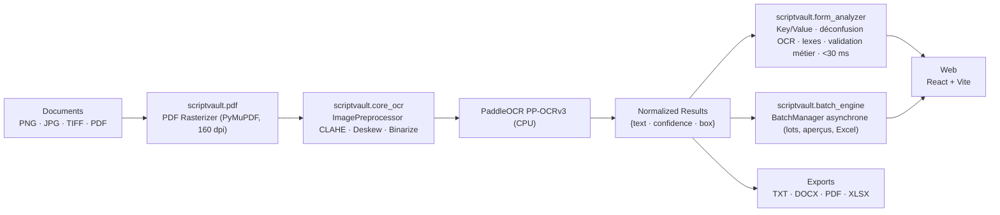

<div align="center">

# ScriptVault OCR

### On-Premise Handwritten Text Recognition & Automatic Form Analysis

**Your documents never leave your machine.**

[](LICENSE)
[](https://www.python.org/downloads/)
[](https://github.com/astral-sh/ruff)
[](https://github.com/Omar-khecharem/ScriptVaultOcr/actions)
[](https://github.com/Omar-khecharem/ScriptVaultOcr/releases)

</div>

---

## Table of Contents

- [Overview](#overview)
- [Features](#features)
- [Architecture](#architecture)
- [Repository Structure](#repository-structure)
- [Quick Start](#quick-start)
- [REST API](#rest-api)
- [Form Analysis Pipeline](#form-analysis-pipeline)
- [Compliance & Security Matrix](#compliance--security-matrix)
- [Development](#development)
- [License](#license)

---

## Overview

**ScriptVault OCR** is a fully **on-premise**, **zero-trust** OCR and
document-processing suite. Powered by **PaddleOCR (PP-OCRv6)** on a
CPU-optimized PaddlePaddle runtime, it performs text detection, line
orientation, and recognition entirely on the local machine — **no API calls,
no cloud round-trips, no telemetry, no data leakage**.

A **local post-processing engine** (`scriptvault.form_analyzer`) transforms
the raw OCR lines into a structured **key/value form**: spatial pairing of
labels and values, OCR-deconfusion corrections, tunisian-lexicon matching and
business-rule validation (CIN, dates, série/identifiant consistency). Every
field is classified in 3 risk levels (`valid` / `warning` / `error`) and
fields in error are highlighted **in red** in the web client — all in less
than 30 ms per document.

The platform ships **two clients** around a single shared OCR engine:

| Client | Stack | Description |
|---|---|---|
| **Web** | React + Vite (JSX) | Interface navigateur : upload, overlay des boîtes aligné, édition, analyse de formulaire, exports, suivi des lots — alimentée par l'API locale |
| **Backend** | Python + FastAPI | API REST locale + moteur partagé (une seule source de vérité), lots OCR asynchrones, export Excel des données |

---

## Features

- **Reconnaissance de texte** — PaddleOCR CPU pour le texte imprimé *et* manuscrit ; pré-traitement adaptatif (CLAHE, deskew, binarisation).
- **Analyse automatique de formulaire** — extraction clé/valeur par appariement spatial, déconfusion OCR (`A2/2oo3` → `2003`, `&` → `2`, …), correction via lexiques tunisiens (noms, prénoms, villes, établissements, matières) et règles métier (CIN, dates, série/identifiant).
- **Classification de risque** — chaque champ est `valid` / `warning` / `error` avec message explicite en français ; signature enseignante détectée par taux d'encre.
- **Traitement par lots** — ingestion massive (TIF multi-pages, PDF, images) en tâche de fond, progression en temps réel, annulation propre, aperçus à la demande, export **Excel** du lot.
- **Exports** — TXT, DOCX, PDF, XLSX ; générés côté serveur (le web reste léger).
- **100 % local** — loopback par défaut, aucun egress réseau, compatible air-gap.
- **Qualité garantie** — 148+ tests (pytest), Ruff, Mypy et build Vite vérifiés par CI sur Linux et Windows.

---

## Architecture



| Module | File | Responsibility |
|---|---|---|
| OCR Engine | `backend/scriptvault/core_ocr.py` | Pipeline de pré-traitement, PaddleOCR 2.x/3.x auto-détection, exceptions typées, CLI |
| Engine Pool | `backend/scriptvault/engines.py` | Pool round-robin thread-safe (asyncio + 1 moteur/thread), timeout, pré-chargement |
| PDF Rasterizer | `backend/scriptvault/pdf.py` | Rasterisation PDF → images (160 dpi) |
| Form Analyzer | `backend/scriptvault/form_analyzer.py` | Post-OCR : extraction spatiale clé/valeur, récolte des champs, corrections OCR, lexes (noms/prénoms/villes), validation métier, < 30 ms |
| Lexicons | `backend/scriptvault/lexicons.py` | Connaissances déclaratives tunisiennes (noms, prénoms, villes, établissements, matières) |
| Batch Engine | `backend/scriptvault/batch_engine.py` | Lots OCR asynchrones, progression, annulation, cache LRU des aperçus, synthèse paginable |
| Security | `backend/scriptvault/security.py` | Hachage fichier, contrôle de type/poids, noms sûrs, stockage isolé par lot |
| Rules Engine | `backend/scriptvault/rules_engine.py` | Validation de cohérence des documents archivés (archives, OCR ré-analysé) |
| Exports | `backend/scriptvault/exporter.py` + `excel_exporter.py` | TXT / DOCX / PDF puis XLSX (feuilles structurées par champs) |
| API Server | `backend/scriptvault/api/` | FastAPI : OCR, health, lots, analyse de formulaire, export |
| Web App | `web/src/` | React : DropZone, canvas overlay, éditeur, jauge de confiance, panneau de formulaire, journal des lots |

---

## Repository Structure

```
ScriptVaultOcr/
├── backend/                        # Moteur partagé + API FastAPI (package `scriptvault`)
│   ├── main.py                     #   python main.py  → uvicorn
│   ├── pyproject.toml              #   package installable (pip install -e backend)
│   ├── requirements.txt            #   dépendances verrouillées
│   ├── scriptvault/
│   │   ├── core_ocr.py             #   OCR PaddleOCR CPU + pré-traitement adaptatif
│   │   ├── engines.py              #   EngineManager : pool thread-safe asyncio
│   │   ├── pdf.py                  #   rasterisation PDF → images
│   │   ├── form_analyzer.py        #   analyse clé/valeur spatiale + validation métier (<30ms)
│   │   ├── lexicons.py             #   lexes tunisiens (noms, prénoms, villes, établissements)
│   │   ├── batch_engine.py         #   BatchManager : lots OCR async, suivi, Excel
│   │   ├── security.py             #   hachage, contrôle des fichiers, stockage sûr
│   │   ├── rules_engine.py         #   validation des données (CIN, compteurs OCR)
│   │   ├── database.py             #   persistance des lots (SQLite)
│   │   ├── exporter.py             #   TXT / DOCX / PDF
│   │   ├── excel_exporter.py       #   XLSX par lot
│   │   ├── config.py               #   settings via variables SCRIPTVAULT_*
│   │   ├── schemas.py              #   contrats Pydantic (dont FormFieldResult)
│   │   └── api/                    #   FastAPI (app factory, routes : health/ocr/batches/form/export)
│   └── tests/                      #   test_core, test_api, test_form_analyzer, test_batches, test_security, test_rules
├── web/                            # Interface React + Vite (indépendante)
│   ├── package.json                #   react · vite · @vitejs/plugin-react
│   ├── vite.config.js              #   proxy /api → backend local
│   └── src/
│       ├── App.jsx                 #   orchestration (files, OCR, lots, export)
│       ├── api/client.js           #   client HTTP (XHR upload progressé, analyzeForm)
│       └── components/             #   DropZone · ImageCanvas · EditorPanel · FormPanel · FileList · Gauge
├── models/                         # Poids OCR optionnels (build 100% hors-ligne)
├── .github/workflows/ci.yml        # CI : Ruff + Mypy + Pytest + build web
├── pyproject.toml                  # Config racine (Ruff / Mypy / Pytest)
└── README.md
```

---

## Quick Start

### Prerequisites

- **Python 3.10+** (3.13 recommended et testé par CI)
- **Node 18+** pour le web
- **Windows 10/11, Ubuntu 20.04+, ou macOS arm64**

### 1. Backend (API)

```bash
cd backend
python -m venv .venv
# Windows : .venv\Scripts\activate   |   Linux/macOS : source .venv/bin/activate
pip install -r requirements.txt

python main.py --lang fr            # http://127.0.0.1:8000  — docs interactives : /docs
```

Configuration par variables d'environnement `SCRIPTVAULT_*` (`SCRIPTVAULT_PORT`,
`SCRIPTVAULT_LANG`, `SCRIPTVAULT_MODEL_DIR`, `SCRIPTVAULT_MAX_CONCURRENCY`,
`SCRIPTVAULT_CORS_ORIGINS`, …).

> **First launch:** les poids PP-OCRv3 sont chargés automatiquement dans
> `~/.paddlex/official_models` (ou fournis via `models/`), puis tout
> fonctionne 100% hors-ligne.

### 2. Web (React + Vite)

```bash
cd web
npm install
npm run dev                         # http://localhost:5173
```

Le serveur Vite proxy `/api` vers `http://127.0.0.1:8000` (backend requis).

---

## REST API

| Method | Endpoint | Description |
|---|---|---|
| `GET` | `/api/health` | État du serveur, pool de moteurs, pré-chargement |
| `POST` | `/api/ocr/single` | OCR d'une image **ou PDF** (multipart `file`) — `preview=true` renvoie l'image analysée (overlay aligné) |
| `POST` | `/api/ocr/batch` | Lot de fichiers (multipart `files`, concurrence bornée, échecs isolés) |
| `POST` | `/api/batches` | Créer un lot depuis des fichiers **ou un dossier localStorage** |
| `GET` | `/api/batches` | Historique des lots (résumés légers) |
| `GET` | `/api/batches/{job_id}` | Progression et statistiques d'un lot |
| `GET` | `/api/batches/{job_id}/files` | Synthèses des fichiers (paginable) |
| `GET` | `/api/batches/{job_id}/files/{file_id}` | Détail complet d'un fichier |
| `GET` | `/api/batches/{job_id}/preview/{file_id}` | Aperçu PNG de la page analysée |
| `POST` | `/api/batches/{job_id}/cancel` | Annuler un lot en cours |
| `DELETE` | `/api/batches/{job_id}` | Supprimer un lot (mémoire + disque) |
| `GET` | `/api/batches/{job_id}/export.xlsx` | Export **Excel** des données du lot |
| `POST` | `/api/form/analyze` | Post-traitement : items OCR → formulaire clé/valeur validé (`valid`/`warning`/`error`), < 30 ms |
| `POST` | `/api/export` | Export d'un texte corrigé : `{"format": "txt\|docx\|pdf", "text": "…"}` |

```bash
# Exemple : OCR d'une image
curl -F "file=@scan.png" -F "lang=fr" "http://127.0.0.1:8000/api/ocr/single"

# Exemple : analyse de formulaire à partir des items OCR d'une page
curl -X POST "http://127.0.0.1:8000/api/form/analyze" \
     -H "Content-Type: application/json" \
     -d '{"file_name": "scan.png", "items": [
           {"text": "Nom :", "confidence": 0.98, "box": [[50,100],[260,100],[260,134],[50,134]]},
           {"text": "Didi", "confidence": 0.96, "box": [[280,100],[520,100],[520,134],[280,134]]}
         ]}'
```

Réponse type d'`/api/form/analyze` :

```json
{
  "file_name": "scan.png",
  "is_form": true,
  "global_confidence": 0.94,
  "processing_time_ms": 0.52,
  "fields": [
    { "key": "cin", "label": "N° C.I.N ou N° du passeport",
      "value": "09728320", "confidence": 0.94, "status": "valid",
      "error_message": null, "bounding_box": [[280,100],[520,100],[520,134],[280,134]] },
    { "key": "identifiant", "label": "Identifiant", "value": "615001",
      "confidence": 0.90, "status": "error",
      "error_message": "L'identifiant doit commencer par la série (514).",
      "bounding_box": null }
  ]
}
```

Chaque champ est affiché selon son `status` : **vert** (`valid`), **orange**
(`warning`, confiance 70–85 %) ou **rouge** (`error`, confiance < 70 % ou
règle métier violée).

---

## Form Analysis Pipeline

1. **Extraction spatiale** — chaque étiquette connue est associée à sa valeur
   par géométrie (ligne/sous-ligne), indépendamment du rendu ;
2. **Récolte des champs numériques** — CIN, série, identifiant, nombre de
   cahiers sont recherchés en zones voisines de l'étiquette ;
3. **Récolte des champs nominatifs** — si un champ nom/prénom est vide
   (glyphe parasite), le voisin lexicographique le plus plausible de la page
   est récupéré par distance au label ;
4. **Corrections OCR** — table de confusion (p. ex. `2`→`&`), noms de
   lexiques (ex. `Elloom` → `Elloumi`), dates tolérantes (`Lundi 03 Juin 2024 à 8 H` → `03/06/2024`) ;
5. **Validation métier** — CIN (8 chiffres), dates réelles, cohérence
   série/identifiant, durée, anonymat ;
6. **Classification** — `valid` / `warning` / `error` avec message français
   explicite et confiance recalculée après correction.

> La détection « zone de signature vide » est effectuée par ratio d'encre
> sous l'étiquette (une signature manquante est signalée en rouge).

---

## Compliance & Security Matrix

| Capability | Status | Details |
|---|---|---|
| **Inference location** | 100% on-premise | PaddlePaddle CPU runtime; no external inference API |
| **Runtime network egress** | None | No telemetry, no crash reporting, no analytics. Firewall / air-gap friendly |
| **Data at rest** | User-controlled | Documents read in memory; exports written where the user chooses |
| **API binding** | Loopback par défaut | `127.0.0.1` (exposition réseau explicite via `--host`) |
| **Model downloads** | One-time / optional | Weights cached in `~/.paddlex` (or bundled via `--model-dir`) |
| **Zero-Trust readiness** | Compatible | Runs in air-gapped environments with bundled models |
| **GDPR readiness** | Ready | No third-party processing; no cross-border transfer; no profiling |
| **Dependency policy** | Locked | `requirements.txt` pins exact versions (supply-chain traceability) |
| **Licensing** | Open | Apache-2.0, permissive for commercial embedding |

---

## Development

```bash
# Racine : config Ruff / Mypy / Pytest partagée
pip install ruff mypy pytest

ruff check .                       # lint (backend + racine)
ruff format --check .              # format

# Tests (sans PaddlePaddle : moteur factice injecté)
pip install -e ./backend --no-deps
pip install pytest httpx fastapi "uvicorn[standard]" python-multipart opencv-contrib-python numpy reportlab python-docx PyMuPDF

python -m pytest backend/tests -q

# Web
cd web && npm install && npm run build
```

CI exécute tout ce qui précède sur **Ubuntu** et **Windows** (Python) et le
build **Vite** pour chaque push sur `main`.

---

## License

Distributed under the **Apache License 2.0**. See [LICENSE](LICENSE) for the
full text. This project depends on third-party libraries subject to their own
licenses (PaddlePaddle, PaddleOCR, FastAPI, React, Vite, …).

---

## Contact

- **Issues & feature requests:** [GitHub Issues](https://github.com/Omar-khecharem/ScriptVaultOcr/issues)
- **Maintainer:** Omar Khecharem