<div align="center">

# ScriptVault OCR

### Enterprise-Grade On-Premise Handwritten Text Recognition

**Your documents never leave your machine.**

[](LICENSE)
[](https://www.python.org/downloads/)
[](https://github.com/astral-sh/ruff)
[](https://github.com/Omar-khecharem/scriptvault_ocr/actions)
[](README.md#compliance--security-matrix)
[](https://github.com/Omar-khecharem/scriptvault_ocr/releases)

</div>

---

## Table of Contents

- [Overview](#overview)
- [Key Features](#key-features)
- [Architecture](#architecture)
- [Quick Start](#quick-start)
- [Command-Line Interface](#command-line-interface)
- [Deployment: Build a Standalone `.exe`](#deployment-build-a-standalone-exe)
- [Compliance & Security Matrix](#compliance--security-matrix)
- [Repository Structure](#repository-structure)
- [Development](#development)
- [Contributing](#contributing)
- [License](#license)
- [Contact](#contact)

---

## Overview

**ScriptVault OCR** is a fully **on-premise**, **zero-trust** desktop OCR suite
for documents, scans, and PDFs. Powered by **PaddleOCR (PP-OCRv6)** on a
CPU-optimized PaddlePaddle runtime, it performs text detection, line
orientation, and recognition entirely on the local machine — **no API calls,
no cloud round-trips, no telemetry, no data leakage**.

A polished **PySide6 desktop application** wraps the engine with drag-and-drop
ingestion, live preprocessing preview, per-line confidence scoring, and
one-click export to **TXT / DOCX / PDF (selectable text layer)**.

---

## Key Features

- **🔒 Zero-Data Leakage** — 100% local inference. No external API, no
  analytics, no crash reporting. Works in air-gapped environments.
- **⚡ Sub-second Latency** — CPU-optimized runtime (OpenMP / MKL threads),
  single-threaded inference hot-path, batch processing, and model weights
  pre-loaded in RAM.
- **🧠 Adaptive Preprocessing** — CLAHE contrast equalization, Hough-based
  deskewing, and polarity-normalized adaptive binarization for scans of any
  quality.
- **🖥️ Native Desktop GUI** — PySide6 interface with drag-and-drop `DropZone`,
  zoom/pan `ImageCanvas`, confidence-colored overlay boxes, rich-text
  `EditorPanel`, circular `ConfidenceGauge`, and dark/light themes.
- **🛠️ Robust Batch Engine** — `QThread` worker with a bounded queue
  (backpressure), graceful cancellation (`CancellationToken`), and automatic
  memory reclamation between images.
- **📤 Multi-format Export** — TXT, DOCX, and PDF with a **selectable text
  layer** for searchable archives.
- **🌍 Multilingual** — `en`, `fr`, `ch`, and more, via PaddleOCR language
  models.
- **🗜️ Single-File Deployment** — Nuitka (recommended) or PyInstaller bundling
  into a self-contained `.exe`, optionally embedding the model weights for
  fully offline distribution.

---

## Architecture

```mermaid
flowchart LR
    A["Documents<br/>PNG · JPG · TIFF · PDF"] --> B["PyMuPDF<br/>PDF Rasterizer<br/>(160 dpi)"]
    B --> C["ImagePreprocessor<br/>CLAHE · Deskew · Binarize"]
    C --> D["PaddleOCR PP-OCRv6 (CPU)"]
    D --> E["Textline Orientation<br/>PP-LCNet_x1_0"]
    E --> F["Text Detection<br/>DBNet"]
    F --> G["Text Recognition<br/>CRNN"]
    G --> H["Normalized Results<br/>{text · confidence · box}"]
    H --> I["BatchWorker<br/>PySide6 QThread"]
    I --> J["Desktop GUI<br/>Canvas · Editor · Gauge"]
    J --> K["Exports<br/>TXT · DOCX · PDF"]
```



| Module | File | Responsibility |
|---|---|---|
| OCR Engine | `core_ocr.py` | Preprocessing pipeline, PaddleOCR 2.x/3.x auto-detection, typed exceptions, CLI |
| Batch Worker | `worker_thread.py` | `QThread` queue, batch draining, cancellation, signals, CLI |
| Desktop App | `gui_app.py` | PySide6 UI, drag-and-drop, exports, asynchronous engine loading |
| Build Tooling | `build_installer.py` | Nuitka / PyInstaller command generation, model discovery, release zips |

---

## Quick Start

### Prerequisites

- **Python 3.10+** (3.13 recommended and CI-tested)
- **Windows 10/11, Ubuntu 20.04+, or macOS arm64**

### 1. Clone & install

```bash
git clone https://github.com/Omar-khecharem/scriptvault_ocr.git
cd scriptvault_ocr

python -m venv .venv
source .venv/bin/activate        # Windows: .venv\Scripts\activate

pip install -r requirements.txt
```

### 2. Launch the desktop application

```bash
python gui_app.py --lang fr      # en, fr, ch, ...
```

Drag and drop images or PDFs into the drop zone, press **Start OCR**, review
and edit the recognized text, then export.

> **First launch:** the PP-OCRv6 model weights are downloaded once into
> `~/.paddlex/official_models` (requires an internet connection the first
> time only). Afterwards, everything runs fully offline.

### 3. Run from the command line

```bash
# OCR a single image to the console (JSON)
python core_ocr.py scan_001.png --lang fr

# Batch-process a folder of images
python core_ocr.py --help                     # full engine options
python worker_thread.py img1.png img2.png --batch 4 --lang fr
```

---

## Command-Line Interface

| Module | Usage |
|---|---|
| `core_ocr.py` | `python core_ocr.py <image> [--lang fr] [--no-preprocess] [--threads N] [--model-dir DIR] [--mp]` |
| `worker_thread.py` | `python worker_thread.py <images...> [--lang fr] [--batch N] [--queue N] [--threads N] [--model-dir DIR]` |
| `gui_app.py` | `python gui_app.py [--lang fr] [--threads N] [--model-dir DIR] [--batch N]` |
| `build_installer.py` | `python build_installer.py [--tool nuitka\|pyinstaller\|auto] [--mode onefile\|onedir] [--zip]` |

---

## Deployment: Build a Standalone `.exe`

Nuitka is the recommended compiler (C++-compiled, obfuscated source, smaller
footprint). PyInstaller is supported as an alternative.

```bash
# 1. (Optional) Place offline model weights for a fully self-contained build:
#    models/det/  models/rec/  models/cls/
#    (auto-discovered recursively; marker files: .pdparams/.pdmodel/.onnx)

# 2. Build the single-file executable and a release ZIP:
python build_installer.py --tool nuitka --mode onefile --zip
#    -> dist/ScriptVaultOCR.exe
#    -> dist/ScriptVaultOCR-win-amd64-onefile.zip

# 3. Alternatives:
python build_installer.py --tool pyinstaller --mode onefile --zip   # PyInstaller
python build_installer.py --tool nuitka --mode onedir               # folder app
python build_installer.py --dry-run                                 # preview command
```

The build automatically:
- embeds the **PySide6** plugin (Nuitka) or collects **paddle / paddleocr /
  PyMuPDF** packages (PyInstaller),
- bundles model weights when present under `models/`,
- locates `assets/icon.ico` or `assets/icon.png` when provided,
- produces a versioned release archive when `--zip` is set.

> **Note:** first build downloads compilers/toolchains (MSVC/ccache). Build
> machines require network access; the produced `.exe` does not.

---

## Compliance & Security Matrix

| Capability | Status | Details |
|---|---|---|
| **Inference location** | 100% on-premise | PaddlePaddle CPU runtime; no external inference API |
| **Runtime network egress** | None | No telemetry, no crash reporting, no analytics. Firewall/air-gap friendly |
| **Data at rest** | User-controlled | Documents are read in memory; exports are written where the user chooses |
| **Model downloads** | One-time / optional | Weights cached in `~/.paddlex` (or bundled via `--model-dir`) |
| **Zero-Trust readiness** | Compatible | Runs in air-gapped environments with bundled models |
| **GDPR readiness** | Ready | No data processed by third parties; no cross-border transfer; no profiling |
| **Dependency policy** | Locked | `requirements.txt` pins exact versions (supply-chain traceability) |
| **Licensing** | Open | Apache-2.0, permissive for commercial embedding |

---

## Repository Structure

```
scriptvault_ocr/
├── core_ocr.py                  # OCR engine: preprocessing + PaddleOCR (2.x/3.x)
├── worker_thread.py             # Batch QThread worker (queue, cancellation, signals)
├── gui_app.py                   # PySide6 desktop application
├── build_installer.py           # Nuitka / PyInstaller build automation
├── requirements.txt             # Locked runtime & build dependencies
├── pyproject.toml               # Ruff / Mypy / pytest configuration
├── tests/                       # Unit tests (CI)
│   ├── test_core.py
│   ├── test_worker.py
│   └── test_build.py
├── .github/workflows/ci.yml     # CI: lint + type-check + tests (Ubuntu, Windows)
├── .gitignore                   # VCS exclusions (artifacts, weights, caches)
├── push_to_github.sh            # One-command release push (Bash)
├── push_to_github.bat           # One-command release push (Windows)
└── LICENSE                      # Apache-2.0
```

---

## Development

```bash
pip install -e ".[dev]"          # or: pip install ruff mypy pytest

ruff check .                     # lint
ruff format .                    # format (optional, auto)
mypy core_ocr.py worker_thread.py build_installer.py   # type check
pytest tests -q                  # unit tests
```

CI runs all of the above on **Ubuntu** and **Windows** for every push and pull
request targeting `main`.

---

## Contributing

Contributions are welcome and expected to meet the quality bar enforced by CI:

1. Fork the repository and create a feature branch.
2. Keep changes focused; write tests for new behavior.
3. Run `ruff check .`, `mypy ...`, and `pytest tests -q` locally.
4. Use [Conventional Commits](https://www.conventionalcommits.org/)
   (`feat:`, `fix:`, `docs:`, `build:`, `ci:`, ...).
5. Open a pull request against `main`.

---

## License

Distributed under the **Apache License 2.0**. See [LICENSE](LICENSE) for the
full text. This project also depends on third-party libraries subject to
their own licenses (PaddlePaddle, PaddleOCR, PySide6, OpenCV, Nuitka).

---

## Contact

- **Issues & feature requests:** [GitHub Issues](https://github.com/Omar-khecharem/scriptvault_ocr/issues)
- **Security disclosures:** please open a confidential issue or contact the maintainer privately before public disclosure.
- **Maintainer:** Omar Khecharem
