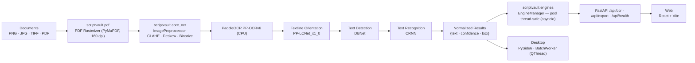

<div align="center">

# ScriptVault OCR

### Enterprise-Grade On-Premise Handwritten Text Recognition

**Your documents never leave your machine.**

[](LICENSE)
[](https://www.python.org/downloads/)
[](https://github.com/astral-sh/ruff)
[](https://github.com/Omar-khecharem/scriptvault_ocr/actions)
[](README.md#compliance--security-matrix)
[](https://github.com/Omar-khecharem/scriptvault_ocr/releases)

</div>

---

## Table of Contents

- [Overview](#overview)
- [Architecture](#architecture)
- [Repository Structure](#repository-structure)
- [Quick Start](#quick-start)
  - [1. Backend (API)](#1-backend-api)
  - [2. Desktop (GUI PySide6)](#2-desktop-gui-pyside6)
  - [3. Web (React + Vite)](#3-web-react--vite)
- [REST API](#rest-api)
- [Deployment: Build a Standalone `.exe`](#deployment-build-a-standalone-exe)
- [Compliance & Security Matrix](#compliance--security-matrix)
- [Development](#development)
- [Contributing](#contributing)
- [License](#license)
- [Contact](#contact)

---

## Overview

**ScriptVault OCR** is a fully **on-premise**, **zero-trust** OCR suite for
documents, scans, and PDFs. Powered by **PaddleOCR (PP-OCRv6)** on a
CPU-optimized PaddlePaddle runtime, it performs text detection, line
orientation, and recognition entirely on the local machine — **no API calls,
no cloud round-trips, no telemetry, no data leakage**.

The monorepo ships **three clients** around a single shared OCR engine:

| Client | Stack | Description |
|---|---|---|
| **Desktop** | Python + PySide6 | GUI complète : drag-and-drop, prévisualisation, édition, exports TXT/DOCX/PDF, build `.exe` autonome |
| **Web** | React + Vite (JSX) | Interface navigateur : upload, overlay des boîtes aligné, édition, exports — alimentée par l'API locale |
| **Backend** | Python + FastAPI | API REST locale + moteur partagé (une seule source de vérité) |

---

## Architecture



| Module | File | Responsibility |
|---|---|---|
| OCR Engine | `backend/scriptvault/core_ocr.py` | Preprocessing pipeline, PaddleOCR 2.x/3.x auto-detection, typed exceptions, CLI |
| Engine Pool | `backend/scriptvault/engines.py` | Pool round-robin thread-safe (asyncio + 1 moteur/thread), timeout, preload |
| API Server | `backend/scriptvault/api/` | FastAPI : OCR single/batch, export TXT/DOCX/PDF, health |
| Desktop App | `desktop/gui_app.py` | PySide6 UI, drag-and-drop, exports, chargement asynchrone du moteur |
| Batch Worker | `desktop/worker_thread.py` | `QThread` queue bornée, annulation, signaux |
| Web App | `web/src/` | React : DropZone, canvas overlay, éditeur, jauge de confiance, thèmes |
| Build Tooling | `desktop/build_installer.py` | Nuitka / PyInstaller command generation, model discovery, release zips |

---

## Repository Structure

```
scriptvault_ocr/
├── backend/                       # Moteur partagé + API FastAPI (package `scriptvault`)
│   ├── main.py                    #   python main.py  → uvicorn
│   ├── pyproject.toml             #   package installable (pip install -e backend)
│   ├── requirements.txt           #   dépendances verrouillées
│   ├── scriptvault/
│   │   ├── core_ocr.py            #   moteur PaddleOCR (ImagePreprocessor, LocalOCREngine)
│   │   ├── engines.py             #   EngineManager : pool thread-safe asyncio
│   │   ├── pdf.py                 #   rasterisation PDF → images
│   │   ├── exporter.py            #   TXT / DOCX / PDF (couche texte)
│   │   ├── config.py              #   settings via variables SCRIPTVAULT_*
│   │   ├── schemas.py             #   contrats Pydantic de l'API
│   │   └── api/                   #   FastAPI (app factory, routes, handlers)
│   └── tests/                     #   test_core.py (moteur) + test_api.py (REST, moteur factice)
├── desktop/                       # Application PySide6 (réutilise le package scriptvault)
│   ├── gui_app.py                 #   interface desktop
│   ├── worker_thread.py           #   worker QThread par lots
│   ├── build_installer.py         #   Nuitka / PyInstaller
│   ├── requirements.txt           #   PySide6 + -e ../backend
│   └── tests/                     #   test_worker.py + test_build.py
├── web/                           # Interface React + Vite (indépendante)
│   ├── package.json               #   react · vite · @vitejs/plugin-react
│   ├── vite.config.js             #   proxy /api → backend local
│   └── src/
│       ├── App.jsx                #   orchestration (files, OCR, exports)
│       ├── api/client.js          #   client HTTP (XHR upload progressé)
│       └── components/            #   DropZone · ImageCanvas · EditorPanel · FileList · Gauge
├── models/                        # Poids OCR optionnels (build 100% hors-ligne)
├── .github/workflows/ci.yml       # CI : Ruff + Mypy + Pytest + build web
├── pyproject.toml                 # Config racine (Ruff / Mypy / Pytest)
└── README.md
```

---

## Quick Start

### Prerequisites

- **Python 3.10+** (3.13 recommended et CI-tested) pour backend + desktop
- **Node 18+** pour le web
- **Windows 10/11, Ubuntu 20.04+, ou macOS arm64**

> Un seul environnement virtuel suffit pour backend + desktop (moteur partagé).
> Le web est indépendant (npm).

### 1. Backend (API)

```bash
cd backend
python -m venv .venv
# Windows : .venv\Scripts\activate   |   Linux/macOS : source .venv/bin/activate
pip install -r requirements.txt

python main.py --lang fr            # http://127.0.0.1:8000  — docs interactives : /docs
```

La configuration se fait par variables d'environnement `SCRIPTVAULT_*`
(`SCRIPTVAULT_PORT`, `SCRIPTVAULT_LANG`, `SCRIPTVAULT_MODEL_DIR`,
`SCRIPTVAULT_MAX_CONCURRENCY`, `SCRIPTVAULT_CORS_ORIGINS`, …).

> **First launch:** les poids PP-OCRv6 sont téléchargés une seule fois dans
> `~/.paddlex/official_models`, puis tout fonctionne 100% hors-ligne.

### 2. Desktop (GUI PySide6)

```bash
pip install -r desktop/requirements.txt   # installe aussi le moteur (../backend)
cd desktop
python gui_app.py --lang fr               # en, fr, ch, ...
```

Drag and drop images ou PDFs dans la zone, **Start OCR**, corrigez le texte,
exportez en TXT / DOCX / PDF.

### 3. Web (React + Vite)

```bash
cd web
npm install
npm run dev                         # http://localhost:5173
```

Le serveur Vite proxy `/api` vers `http://127.0.0.1:8000` (backend requis).

---

## REST API

| Method | Endpoint | Description |
|---|---|---|
| `GET` | `/api/health` | État du serveur, pool de moteurs, pré-chargement |
| `POST` | `/api/ocr/single` | OCR d'une image **ou PDF** (multipart `file`) — `preview=true` renvoie l'image analysée (overlay aligné) |
| `POST` | `/api/ocr/batch` | Lot de fichiers (multipart `files`, concurrence bornée, échecs isolés) |
| `POST` | `/api/export` | Export d'un texte corrigé : `{"format": "txt\|docx\|pdf", "text": "…"}` |

```bash
# Exemple : OCR d'une image
curl -F "file=@scan.png" -F "lang=fr" "http://127.0.0.1:8000/api/ocr/single"
```

Réponse type d'`/api/ocr/single` :

```json
{
  "file": "scan.png",
  "status": "ok",
  "pages": [
    {
      "page": 1, "width": 1200, "height": 900, "elapsed_ms": 842.0,
      "text": "Bonjour le monde",
      "confidence": 0.97,
      "items": [
        { "text": "Bonjour le monde", "confidence": 0.97,
          "box": [[10, 20], [520, 20], [520, 52], [10, 52]] }
      ],
      "preview": "data:image/png;base64,…"
    }
  ],
  "text": "Bonjour le monde",
  "confidence": 0.97,
  "elapsed_ms": 842.0
}
```

---

## Deployment: Build a Standalone `.exe`

Depuis le dossier `desktop/` (Nuitka recommandé, PyInstaller en alternative) :

```bash
# 1. (Optionnel) Poids hors-ligne dans models/det, models/rec, models/cls

# 2. Build onefile + archive release :
python build_installer.py --tool nuitka --mode onefile --zip
#    -> dist/ScriptVaultOCR.exe

python build_installer.py --tool pyinstaller --mode onefile --zip   # alternative
python build_installer.py --dry-run                                 # aperçu de la commande
```

Le build embarque automatiquement le package partagé `scriptvault`, les
plugins PySide6, PaddlePaddle/PaddleOCR/PyMuPDF, les poids de modèles
(présents dans `models/`) et l'icône (`assets/icon.ico` / `icon.png`).

---

## Compliance & Security Matrix

| Capability | Status | Details |
|---|---|---|
| **Inference location** | 100% on-premise | PaddlePaddle CPU runtime; no external inference API |
| **Runtime network egress** | None | No telemetry, no crash reporting, no analytics. Firewall/air-gap friendly |
| **Data at rest** | User-controlled | Documents are read in memory; exports are written where the user chooses |
| **API binding** | Loopback par défaut | `127.0.0.1` (exposition réseau explicite via `--host`) |
| **Model downloads** | One-time / optional | Weights cached in `~/.paddlex` (or bundled via `--model-dir`) |
| **Zero-Trust readiness** | Compatible | Runs in air-gapped environments with bundled models |
| **GDPR readiness** | Ready | No data processed by third parties; no cross-border transfer; no profiling |
| **Dependency policy** | Locked | `requirements.txt` pins exact versions (supply-chain traceability) |
| **Licensing** | Open | Apache-2.0, permissive for commercial embedding |

---

## Development

```bash
# Racine : config Ruff / Mypy / Pytest partagée
pip install ruff mypy pytest

ruff check .                       # lint (backend + desktop + racine)
ruff format --check .              # format
mypy backend/scriptvault backend/main.py desktop/gui_app.py desktop/worker_thread.py desktop/build_installer.py

# Tests (sans PaddlePaddle : moteur factice injecté)
pip install -e ./backend --no-deps
pip install pytest httpx fastapi "uvicorn[standard]" python-multipart opencv-contrib-python numpy reportlab python-docx PyMuPDF PySide6
python -m pytest backend/tests desktop/tests -q

# Web
cd web && npm install && npm run build
```

CI exécute tout ce qui précède sur **Ubuntu** et **Windows** (Python) et le
build **Vite** pour chaque push sur `main`.

---

## Contributing

Contributions are welcome and expected to meet the quality bar enforced by CI:

1. Fork the repository and create a feature branch.
2. Keep changes focused; write tests for new behavior.
3. Run `ruff check .`, `mypy ...`, and `pytest` locally.
4. Use [Conventional Commits](https://www.conventionalcommits.org/)
   (`feat:`, `fix:`, `docs:`, `build:`, `ci:`, ...).
5. Open a pull request against `main`.

---

## License

Distributed under the **Apache License 2.0**. See [LICENSE](LICENSE) for the
full text. This project also depends on third-party libraries subject to
their own licenses (PaddlePaddle, PaddleOCR, PySide6, OpenCV, Nuitka, FastAPI,
React).

---

## Contact

- **Issues & feature requests:** [GitHub Issues](https://github.com/Omar-khecharem/scriptvault_ocr/issues)
- **Security disclosures:** please open a confidential issue or contact the maintainer privately before public disclosure.
- **Maintainer:** Omar Khecharem
